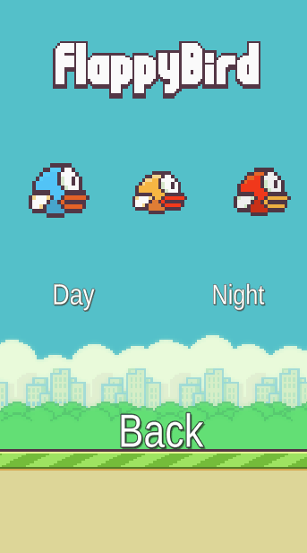
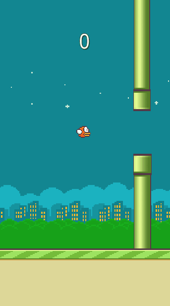
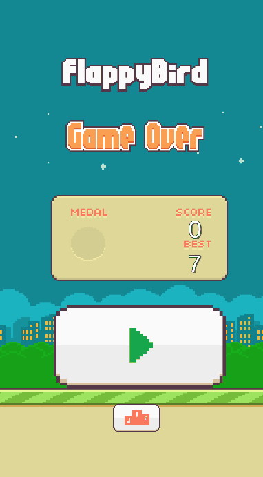

# Flappy-bird
An app built with Unity. It is a fully functional Flappy Bird game with an added feauture.
I have a implemented a leaderboard that stores the highest score even if you exit the app.

I always wanted to choose the bird and the atmosphere so I addead a feauture for this.

This is how the game should run.

Depending on what device you are logged on to, the leaderboard saves your high score.

